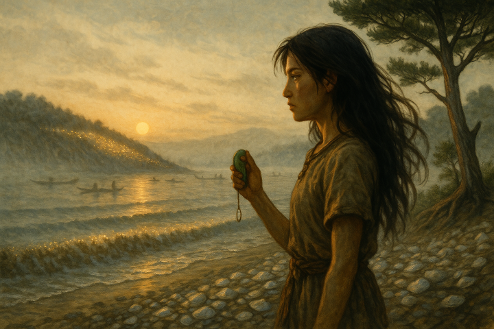

# 🌀 Jomon Fiction

**Jomon Fiction** is a collaborative storytelling project that blends archaeology, landscape studies, and generative AI to reimagine the lives and land of the Jomon period in ancient Japan.

📘 Read this in other languages:

- [🇯🇵 日本語](./README_ja.md)

---


[](https://github.com/satoshi-create/complexity-and-network-webdesign/tree/main/docs/zines/jomon-fiction_cover_zine.png)

## 🐽 Project Overview

Jomon Fiction is envisioned as a subproject of [CANW: Complexity and Network Webdesign](https://github.com/satoshi-create/complexity-and-network-webdesign/tree/main).  
Each short story is based on hub settlements (e.g., Tadao, Aku, Shimonoya sites), and draws on a multilayered structure of narrative, terrain, and network.

This project is built on layered components:

- `story-layer`: Narrative drafts, characters, and episode design
- `research-layer`: Archaeological, geographic, and mythological research
- `code-layer`: Network visualization and geospatial modeling (Python / GeoJSON)
- `publication-layer`: Structured publication of AI images, prompts, and bilingual commentary

---

## 📚 Scenes (MVP)

| Scene ID | Title | Visual |
|----------|--------------------------|--------|
| `001` | The Daughter of the Magatama |  |

→ [📖 Read more](./4_publication-layer/scene_001_magatama/index.md)

---

## 🤖 AI Collaboration

Jomon Fiction actively integrates generative AI in the creation of prompts, images, and structural design.

- DALL·E: Image generation
- GPT-4: Story development, translation, and geographical annotation
- Mermaid / NetworkX / Folium: Visualization tools

---

## 📂 Directory Structure

```
Jomon-Fiction/
├— story-layer/            # Narrative drafts, observations, characters
├— research-layer/         # Archaeological and geographic annotations
├— code-layer/             # Network and map visualization (Python)
├— publication-layer/      # AI-generated images, prompts, and notes
└— README.md
```

```mermaid
graph TD
  A[📜 1_story-layer<br>Narratives & Observations<br>🖋 Writers welcome] --> B[🔍 2_research-layer<br>Research & Interpretation<br>🧪 Annotations]
  B --> C[🧠 3_code-layer<br>Network & Map Code<br>💻 Python, GeoJSON]
  C --> D[🌏 4_publication-layer<br>Image & Prompt Publishing<br>🖼 Translation & Output]
  D --> A

  subgraph AI Support
    A -.-> AI1[Prompt generation & narration]
    B -.-> AI2[Summarization & annotation]
    C -.-> AI3[Code & visualization support]
    D -.-> AI4[Publishing assistance]
  end
```

---

## 🌱 How to Contribute

We welcome contributors with interest in archaeology, spatial storytelling, or networked thinking.

- Interested in prehistoric cultures, Jomon archaeology, or sacred geography
- Passionate about digital storytelling or poetic worldbuilding
- Comfortable with open-source collaboration (GitHub, Markdown, etc.)

👉 [CONTRIBUTING.md](./CONTRIBUTING.md)

📘 Read this in Japanese: [README.ja.md](./README.ja.md)
