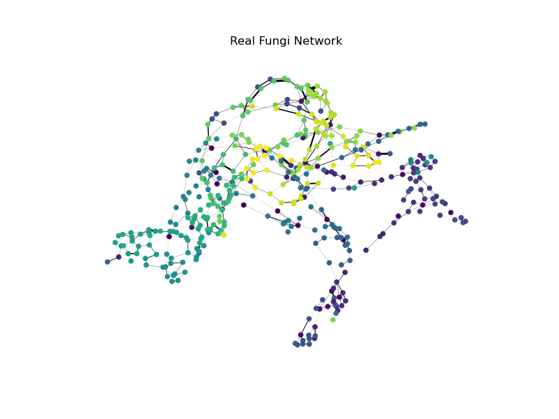

# 🍄 Fungi Network Visualizer

This project visualizes fungal mycelium networks as ecological graphs, blending simplicity with biological realism.
Inspired by real-world data and biological behavior, it models and renders fungal networks in 3D using Python and PyVista.

Originally designed as a minimal working example in the "from-RDB-to-Network" journey, it has now sprouted into a more expressive tool — thanks to community contributions.

🧪 Features:

- Realistic 3D layouts of fungal mycelium networks
- NetworkX-based graph modeling from CSV/JSON
- Visual rendering using PyVista, optionally embedded in Streamlit
- Open for playful extensions and scientific exploration

[]
(https://colab.research.google.com/github/satoshi-create/complexity-and-network-webdesign/blob/main/projects/from-rdb-to-network/fungi-network/notebooks/real-fungi-network.ipynb)

> A sample visualisation of a real fungal mycelium-like network using NetworkX

---

## 📊 Goals

- ✅ Visualize fungal networks as static graphs using NetworkX and matplotlib
- ✅ Start from simple CSV/JSON data formats for accessibility
- 🔄 Explore different network topologies (grid, tree, random)
- 🛤️ Demonstrate a pathway from static data to interactive visualization
- 🧪 Serve as a conceptual prototype for future data-driven network modeling

> Although this MVP uses CSV/JSON, the structure is compatible with RDB-based workflows (e.g. SQLite, Supabase) for future extension.

---

## 🚀 MVP Scope & Steps

| Step | Description                                                                            |
| ---- | -------------------------------------------------------------------------------------- |
| 1️⃣   | Load node and edge data from `sample-network-nodes.csv` and `sample-network-edges.csv` |
| 2️⃣   | Build a NetworkX graph with `node_type` and `weight` attributes                        |
| 3️⃣   | Visualize with matplotlib (color-coded nodes, weighted edges)                          |
| 4️⃣   | Export the result as PNG and embed in this README                                      |
| 5️⃣   | Optionally run the same logic in a Colab notebook (`notebooks/fungi-network.ipynb`)    |

> 🧬 Fungal networks show us that intelligence isn’t centralized — it’s distributed, adaptive, and relational.
> That’s exactly what open-source and collaborative design aim for.

---

## 📂 Structure

- `data/`: Sample network datasets (`*.csv`, `*.json`)
- `scripts/`: Python scripts for loading and visualizing with NetworkX
- `notebooks/`: Google Colab–ready interactive notebooks

## 🧠 Want to take this further?

- Add interactivity with D3.js, Dash, or Streamlit
- Convert CSV/JSON to RDB and explore query-driven graphs
- Use real-world ecological or mycological data

## Data Source Citations

- Mesoscale analyses of fungal networks as an approach for quantifying phenotypic traits.
  Sang Hoon Lee, Mark D. Fricker, Mason A. Porter.
  Journal of Complex Networks, 2016. [bibtex]

Pull requests and ideas welcome! 🌱

**Tags:** `#network-thinking` `#mycelium` `#complexity` `#graph-theory` `#bio-inspired` `#mvp`
