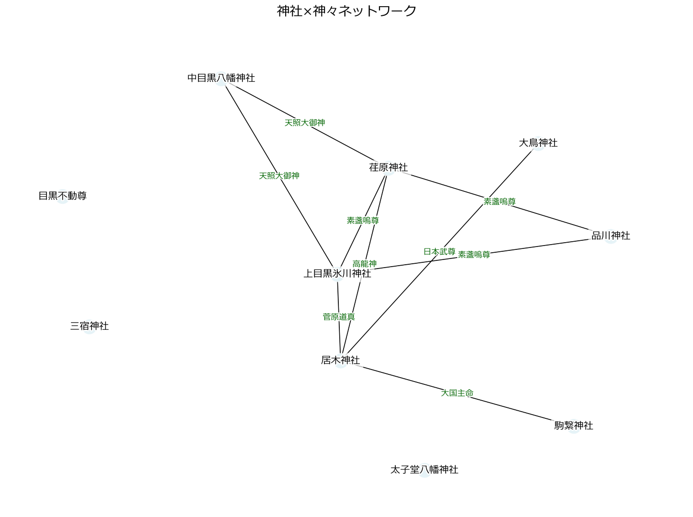

# ⚩ 神社ネットワーク・ビジュアライザー（Shrine Network Visualizer）

このプロジェクトは、神社と神々の関係性を文化的ネットワークとして可視化する取り組みです。  
地形や流域ロジックに基づいて、神社間のつながりを「信仰における共有性（同じ神を祀る）」という観点から再構築します。

📘 他の言語で読む:

- [🇺🇸 English](./README.md)

---

## 🧪 特徴

- 二部グラフ構造：**神社 × 神々**
- 同一神を祀る神社同士を自動で接続
- NetworkX によるグラフ生成・エクスポート（.graphml / .png）
- matplotlib や Jupyter Notebook での可視化
- GeoJSONや地理院地図との連携を見据えた設計



[](https://colab.research.google.com/github/satoshi-create/complexity-and-network-webdesign/blob/create/shrine-network/projects/from-rdb-to-network/shrine-network/notebooks/shrine_network_with_relational_data.ipynb)

---

## 🧩 データモデル

以下は、神社×神々ネットワークを構築するためのCSV3種のER図です：

```mermaid
erDiagram
  SHRINES ||--o{ SHRINE_DEITY : includes
  DEITY ||--o{ SHRINE_DEITY : associated_with

  SHRINES {
    string id PK "神社ID"
    string name "神社名（日本語）"
    string name_en "Shrine Name (英語)"
    float latitude "緯度"
    float longitude "経度"
    string type "神社 or 寺院"
  }

  DEITY {
    string id PK "神ID"
    string name_ja "神名（日本語）"
    string name_en "Deity Name (英語)"
  }

  SHRINE_DEITY {
    string shrine_id FK
    string deity_id FK
    string note "任意：特殊な役割や由緒"
  }
```

---

## 📊 プロジェクトの目標

- CSV/JSONベースの文化ネットワーク構築
- 地形や象徴性に着目した神社配置パターンの探究
- 多層的な文化グラフのプロトタイプ化

---

## 🚀 MVPのステップ

| ステップ | 説明 |
|----------|------|
| 1        | CSVから神社と神々のデータを読み込む         |
| 2        | 同一神を祀る神社同士をエッジで結ぶ           |
| 3        | NetworkXでグラフ構築                         |
| 4        | グラフをエクスポート（PNG/graphml）         |
| 5        | Jupyter Notebookや地図と連携して表示        |

---

## 🏠 神社の例

<div align="center">
<table>
  <tr>
    <td align="center">
      <br/>
      <strong>上目黒氷川神社</strong><br/>
      Susanoo-no-Mikoto（素戔嗚尊）
    </td>
    <td align="center">
      <br/>
      <strong>駒繋神社</strong><br/>
      Takemikazuchi-no-Kami（武甕槌命）
    </td>
  </tr>
  <tr>
    <td align="center">
      <br/>
      <strong>目黒不動尊（瀧泉寺）</strong><br/>
      Fudō Myōō（不動明王）
    </td>
    <td align="center">
      <br/>
      <strong>三宿神社</strong><br/>
      Ōyamatsumi-no-Kami（大山祇命）
    </td>
  </tr>
</table>
</div>

---

## 🗾 地図連携（国土地理院）


👉 [地理院地図で見る（目黒不動周辺）](https://maps.gsi.go.jp/#14/35.635012/139.685755/&base=std&ls=std%7Canaglyphmap_color%2C0.47%7Cexperimental_landformclassification1%2C0.56&blend=0&disp=111&lcd=experimental_landformclassification1&vs=c1g1j0h0k0l0u0t0z0r0s0m0f0)  
👉 [Googleマップで見る（目黒不動周辺）](https://maps.app.goo.gl/ekTJ6fZX6zTnPSL66)  
📎 [GeoJSONダウンロード](./data/shrine_meguro-river.geojson)

> 上記のGeoJSONファイルを地理院地図にアップロードすることで、神社位置をカスタムレイヤーとして表示できます。

---

## 📂 ファイル構成

```
shrine-network/
├── data/            # 神社・神々のCSV/JSONデータ
├── notebooks/       # 探索用Jupyterノートブック
├── public/images/   # 神社写真、地図キャプチャ等
└── README.md
```

---

## 🧠 発展アイデア

### Pythonでできること（ネットワーク・解析系）

| 難易度 | テーマ                  | Pythonツール例                           | 具体的にできること                                                                       | 可視化・分析による期待効果                                                               |
|--------|----------------------|------------------------------------|--------------------------------------------------------------------------------------|-------------------------------------------------------------------------------------|
| 🟢 低   | 空間データ管理・解析     | GeoPandas, Shapely, pyproj        | - 神社データ（緯度経度）をGISデータとして管理<br>- 地形・河川レイヤーとの重ね合わせ         | - 神社の立地特性を地形レイヤーとリンクし、**分布パターンの仮説を検証**                     |
| 🟢 低   | ネットワーク科学        | NetworkX, pandas                  | - 祭神ネットワークの中心性分析・コミュニティ検出<br>- 神社間ネットワーク構造の可視化          | - 祭神ネットワーク構造を可視化し、**神社間の隠れた関係性を発見**                           |
| 🟢 低   | 可視化・マッピング      | Folium, Plotly, Matplotlib, Kepler.gl | - 神社ネットワークをマップ上で可視化<br>- 神社ごとに祀神や由緒をポップアップ表示               | - マップ上の可視化により、**神社・祭神ネットワークの空間的傾向を直感的に理解**               |
| 🔴 高   | 地形データ分析          | Rasterio, GDAL                     | - 標高データ（DEM）や陰影データの解析<br>- DEMと神社の関係性を可視化                         | - 地形条件と神社配置の相関を定量化し、**神社配置の地理的文脈を可視化**                       |
| 🔴 高   | 空間統計・解析          | scipy, PySAL, geopandas            | - 空間自己相関（Moran’s Iなど）<br>- 距離・集積性の統計解析                                  | - 空間的偏りを数値化し、**文化的・宗教的パターンの存在を統計的に裏付け**                    |


---

## 🗂 データ出典

- 各神社の公式サイト等の記述
- 国土地理院地図（GSI Maps）

Pull Request やアイディア、歓迎します！🌿

**タグ:** `#network-thinking` `#shinto` `#gis` `#bipartite-graph` `#cultural-data` `#open-data`
