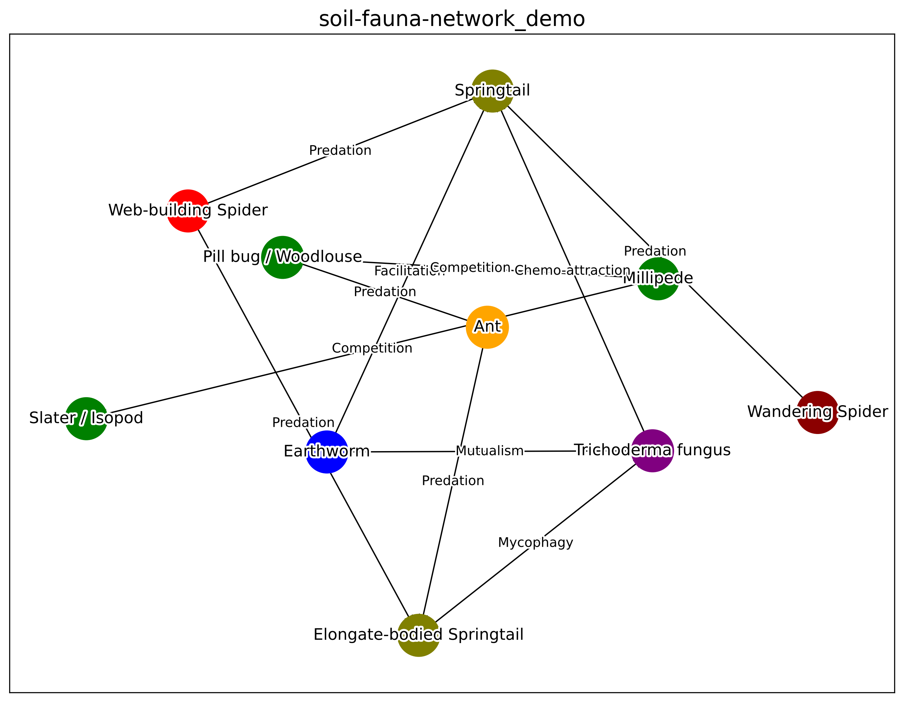

# 🕼 Soil Fauna Network Visualizer

This project visualizes soil fauna interaction networks as ecological graphs, inspired by the complexity of belowground life.
As a sister project to the “Fungi Network Visualizer,” it explores how micro- and mesofauna co-create dynamic ecosystems through predation, mutualism, and detritus processing.
Originally designed as an MVP in the "from-RDB-to-Network" journey, this tool demonstrates how relational ecological data can be transformed into meaningful network structures.

📘 Read this in other languages:

- [🇯🇵 日本語](./README_ja.md)

---

## 🧪 Features

* Species interaction modeling from relational CSV data
* NetworkX-based construction with trophic and ecological roles
* White-stroked Japanese labels for full readability
* Static graph visualization with matplotlib (PNG export ready)
* Ready-to-run Colab notebook and customizable scripts

> A minimal working example showing how species interaction networks emerge from simple CSV-based relational data.

---

## 🤩 Data Model

Below is the ER diagram of the three core CSVs used to construct the soil fauna interaction network.

```mermaid
erDiagram

    SPECIES {
        int id PK
        string scientific_name
        string japanese_name
        string common_name
        string taxonomy
        string taxonomy_en
        string functional_role
        string functional_role_en
        string note
    }

    INTERACTION {
        int source_id FK
        int target_id FK
        string relation_type
        string description
    }

    SITE_SPECIES {
        string site_id FK
        int species_id FK
        int abundance
        date date
        string note
    }

    SITES {
        string site_id PK
        string name
        float latitude
        float longitude
        string soil_type
        string note
    }

    SPECIES ||--o{ INTERACTION : is_source_of
    SPECIES ||--o{ INTERACTION : is_target_of
    SPECIES ||--o{ SITE_SPECIES : occurs_in
    SITES ||--o{ SITE_SPECIES : contains
```

---

## 📊 Goals

* ✅ Visualize species interactions in Japanese using NetworkX
* ✅ Start from intuitive, editable CSV files for species and relations
* ✅ Highlight ecological roles with color coding and font effects
* 🛤️ Connect to real site data with `site_species.csv` and `sites.csv`
* 🔁 Encourage extensions with ecological or educational data

> While this MVP is static and small-scale, its structure supports scaling into full RDB-backed networks and interactive visualization environments.

---

## 🚀 MVP Scope & Steps

| Step | Description (EN)                                                           |
| ---- | -------------------------------------------------------------------------- |
| 1️⃣  | Load species and interaction data from `species.csv` and `interaction.csv` |
| 2️⃣  | Construct a directed graph with roles and labels (Japanese names)          |
| 3️⃣  | Visualize the network with node colors and white-outlined text             |
| 4️⃣  | Export to PNG and embed as documentation asset                             |
| 5️⃣  | Run and edit the logic in `notebooks/soil-fauna-network-demo-ja.ipynb`     |

> 🐛 Soil fauna embody decentralized, adaptive systems. Mapping their interactions reflects not only biodiversity, but a model of collaborative intelligence.

---

## 📂 Structure

* `data/`: CSV files for species, interactions, and site-specific occurrences
* `scripts/`: Python script for visualization and export (static PNG)
* `notebooks/`: Colab-friendly Jupyter notebook with step-by-step execution

---

## 🧠 Want to take this further?

* Add interactivity with PyVis, Plotly, or Streamlit
* Integrate environmental metadata (soil type, moisture, etc.)
* Combine with fungi-network for cross-kingdom interaction models
* Build education-friendly views or ecology-based games

---

## 📌 Data Notes

* Species names, roles, and interactions are mock data based on real soil ecology
* Japanese labels are rendered with Meiryo and white stroke for legibility

Pull requests, forks, and fungi-fauna mashups welcome! 🌱

**Tags:** `#network-thinking` `#soil-fauna` `#complexity` `#ecology` `#from-RDB-to-network` `#mvp`
